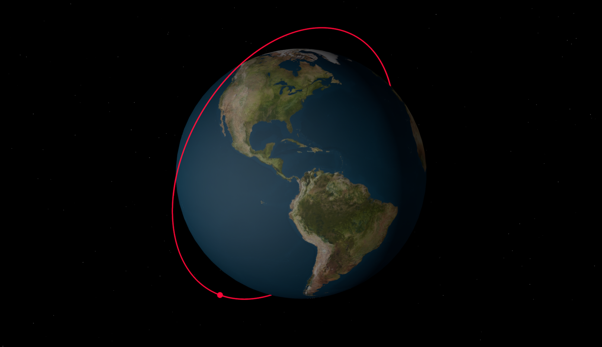
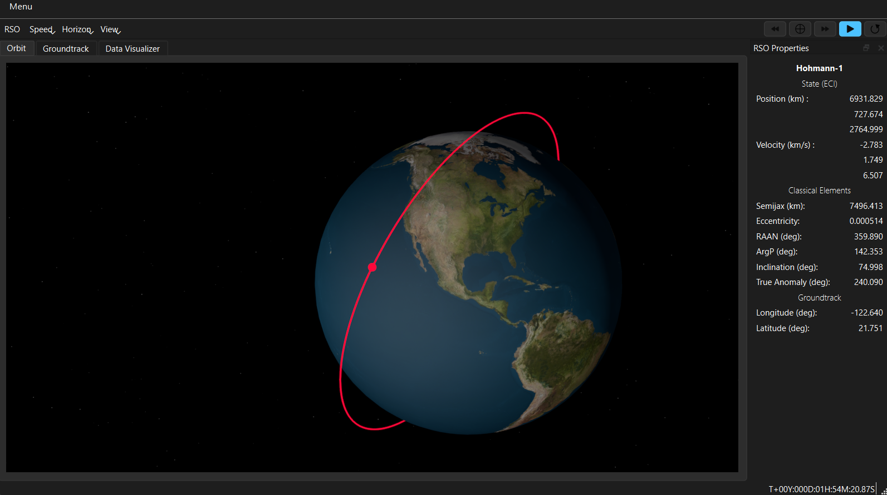
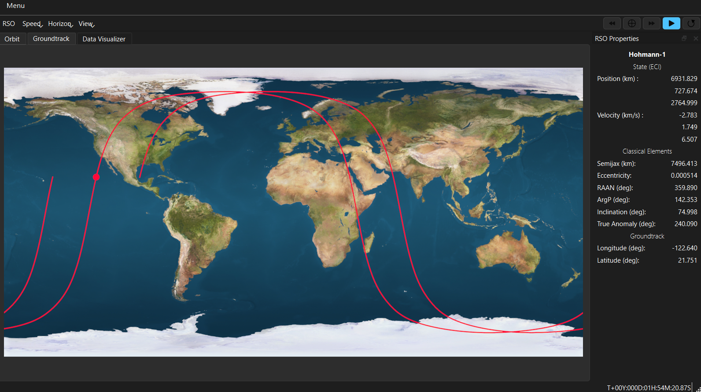
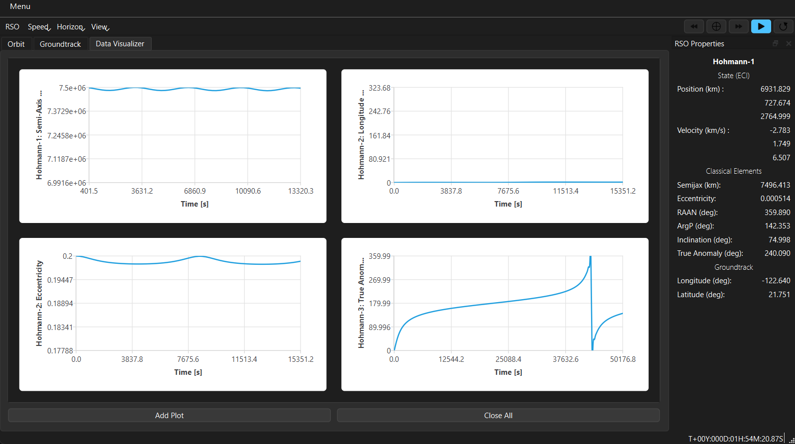
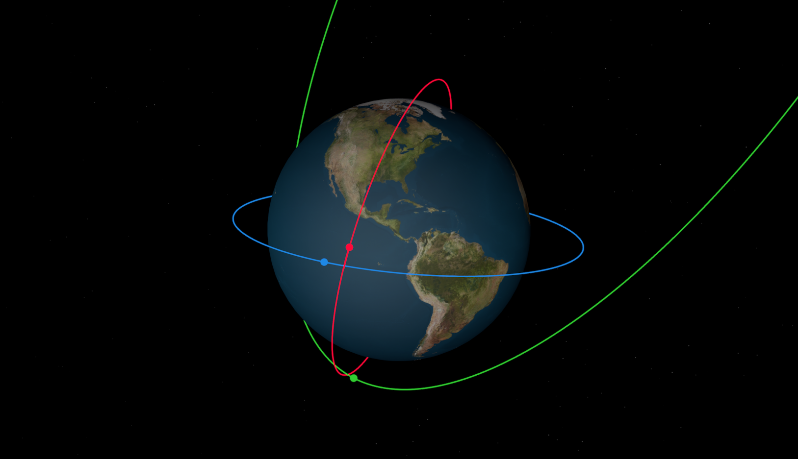
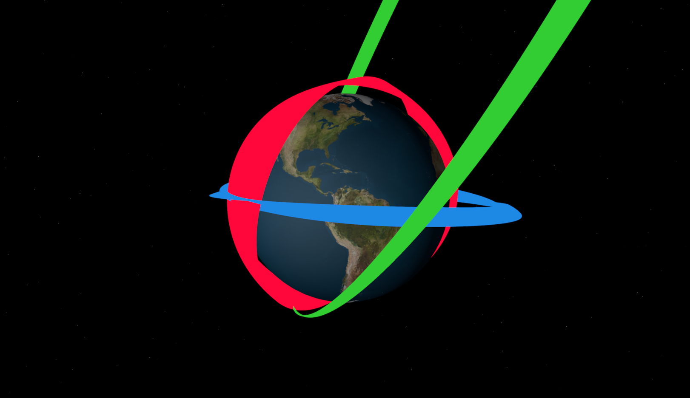

Quickstart Guide
================
This guide is intended to familiarize the user with the basics of orbit propagation and determination in HohmannPy as
well as how to display results. At the end a few of the HohmannPy's more advanced capabilities are highlighted.

Overview
^^^^^^^^^^^^^^^^^^^^^
HohmannPy is designed with the philosophy that a user should be able to run a simulation in as few lines of code as
possible. To that end, the workflow for running a mission is spit up into only three steps:

1) Instantiate an instance of :class:`~hohmannpy.astro.Mission` by passing in the orbit environment you want to simulate (spacecraft, perturbations, etc;).

2) Call the ``simulate()`` method of the ``Mission`` to propagate spacecraft through time.

3) Use the other methods of ``Mission`` such as ``save()`` or ``display`` to view the results.

Missions are highly customizable. You can run a mission with as little as the initial position and velocity of a
satellite and a time horizon. Conversely, you can also simulate constellations with thousands of satellites each
performing maneuvers while under non-Keplerian perturbations. This guide focuses primarily on the bare minimum needed
to run a mission, starting with how to instantiate one.

Setting up a Mission
^^^^^^^^^^^^^^^^^^^^^
At the bare minimum to instantiate a ``Mission`` object three things are needed: a :class:`~hohmannpy.astro.Satellite``,
which represents the spacecraft to simulate, as well as two :class:`~hohmannpy.astro.Time` objects corresponding to the
Gregorian date UT1, times the mission should start and at. The ``Satellite`` object takes in a
:class:`hohmannpy.astro.Orbit`` which corresponds to the state of the satellite's orbit at the mission's start time.

There are a lot of different ways to instantiate an ``Orbit``, all provided through a variety of ``@classmethod``. The
simplest way is to either instantiate it directly or class ``Orbit.from_state()`` which takes in the initial position
and velocity of the satellite as well as the gravitational parameter of the central body.

.. tip::
    In HohmannPy, all vectors are stored as (3, ) Numpy arrays unless otherwise noted. These correspond to (3, 1)
    column vectors. In addition, unless otherwise specified all functions expect vectors to be coordinated in
    planet-centered inertial coordinates. Finally, all quantities are assumed to be first-power SI units like :math:`kg`,
    :math:`m`, or :math:`s` as well as :math:`rad` being the default unit of angular measurement.

For this guide however, we'll take advantage of an alternative instantiation method ``Orbit.from_classical()`` which can
be used to instantiate an orbit using the classical orbital elements. Let's put a satellite in an inclined circular
LEO orbit to start.

.. code-block:: python

    import hohmannpy as hp
    import numpy as np

    sat1 = hp.astro.Satellite(
        name="Hohmann-1",
        starting_orbit=hp.astro.Orbit.from_classical_elements(
            sm_axis=7500e3,
            eccentricity=0,
            raan=0,
            inclination=np.deg2rad(75),
            argp=0,
            true_anomaly=0
        ),
        color="#FF073A",
    )

That is all the mission needs to be able to propagate a satellite. Now let's add a 12-hour time horizon as shown below.

.. code-block:: python

    import hohmannpy as hp
    import numpy as np

    sat1 = hp.astro.Satellite(
        name="Hohmann-1",
        starting_orbit=hp.astro.Orbit.from_classical_elements(
            sm_axis=7500e3,
            eccentricity=0,
            raan=0,
            inclination=np.deg2rad(75),
            argp=0,
            true_anomaly=0
        ),
        color="#FF073A",
    )

    initial_time = hp.astro.Time(date="01/01/2000", time="00:00:00")
    final_time = hp.astro.Time(date="01/01/2000", time="00:12:00")

We are now ready to instantiate the mission. After instantiation, call ``Mission.simulate()`` to propagate the satellite
through time.

.. code-block:: python

    import hohmannpy as hp
    import numpy as np

    sat1 = hp.astro.Satellite(
        name="Hohmann-1",
        starting_orbit=hp.astro.Orbit.from_classical_elements(
            sm_axis=7500e3,
            eccentricity=0,
            raan=0,
            inclination=np.deg2rad(75),
            argp=0,
            true_anomaly=0
        ),
        color="#FF073A",
    )

    initial_time = hp.astro.Time(date="01/01/2000", time="00:00:00")
    final_time = hp.astro.Time(date="01/01/2000", time="00:12:00")

    mission = hp.astro.Mission(
        satellites=[sat1],
        initial_global_time=initial_time,
        final_global_time=final_time,
    )
    mission.simulate()

And we're done! If you did everything properly you should get command line output telling you that propagation completed
in XX.XX seconds. With that, we can move on to retrieving the results of this simulation.

Displaying Results
^^^^^^^^^^^^^^^^^^^^^^^^^^^^
The easiest way to just visually inspect your results is to launch the HohmannPy Viewer using ``Mission.display()``.
This generates a 3D orbit scene which evolves in real time as well as an accompanying groundtrack render. It also has
robust plotting capability. However, it is currently limited to displaying satellite's orbiting the Earth, although this
is purely visually and actual simulation can be done around any planet.

For further analysis, all the information stored about each satellite during the mission can be converted to a CSV using
``Mission.to_csv()``. Alternatively, the ``Mission`` object itself can be pickled and saved as a zip-file using
``Mission.save()`` for later use.

If all you're after is raw data regarding each satellite over the course of the mission, these can be accessed via the
``satellite`` attribute of a ``Mission``. This stores the original satellites passed into the mission during
instantiation as a dictionary of the form ``{"satellite.name: satellite}``. During the course of simulation, the mission
logged data to each satellite as attributes in accordance with the :class:`~hohmannpy.astro.Logger``'s in use by said
mission (more on these in the next section). By default this includes each propagation timestep as well as the
corresponding position and velocity on those timesteps. The information regarding the n-th timestep is stored in Numpy
arrays and can be accessed using ``satellite.time_history[0, N]``, ``satellite.position_history[:, N]``, and
``satellite.velocity_history[:, N]``. For more on the dimensioning of these history arrays see
:class:`~hohammnpy.astro.StateLogger`.

Advanced Features
^^^^^^^^^^^^^^^^^^^^^^^^^^^^^^^^
Now that we've run a basic mission, let's get into some of the more advanced features HohmannPy has to offer. Our goals
are as follows: we want to add two other satellites to the simulation, we want to model the J2 effect, and we want to
log the orbital elements of each satellite at every propagation timestep.

Adding other satellites is trivial. Simply instantiate two additional satellites and then pass them to the mission
alongside the first one. For now let's add another LEO satellite, but this time in a retrograde orbit, as well as a
one other satellite in a Molniya orbit.

.. code-block:: python

    import hohmannpy as hp
    import numpy as np

    sat1 = hp.astro.Satellite(
        name="Hohmann-1",
        starting_orbit=hp.astro.Orbit.from_classical_elements(
            sm_axis=7500e3,
            eccentricity=0,
            raan=0,
            inclination=np.deg2rad(75),
            argp=0,
            true_anomaly=0
        ),
        color="#FF073A",
    )
    sat2 = hp.astro.Satellite(
        name="Hohmann-2",
        starting_orbit=hp.astro.Orbit.from_classical_elements(
            sm_axis=9000e3,
            eccentricity=0.2,
            raan=0,
            inclination=np.deg2rad(175),
            argp=0,
            true_anomaly=0
        ),
        color="#1E88E5"
    )
    sat3 = hp.astro.Satellite(
        name="Hohmann-3",
        starting_orbit=hp.astro.Orbit.from_classical_elements(
            sm_axis=26560e3,
            eccentricity=0.72,
            inclination=63.4 * 3.14 / 180,
            argp=270 * 3.14 / 180,
            raan=50 * 3.14 / 180,
            true_anomaly=0
        ),
        color="#32CD32"
    )

    initial_time = hp.astro.Time(date="01/01/2000", time="00:00:00")
    final_time = hp.astro.Time(date="01/01/2000", time="00:12:00")

    mission = hp.astro.Mission(
        satellites=[sat1, sat2, sat3],
        initial_global_time=initial_time,
        final_global_time=final_time,
    )
    mission.simulate()

Next, let's add the J2 effect as well as classical orbital element logging. ``Mission``'s have quite a few optional
parameters, the first one of interest being ``perturbing_forces``. We are going to instantiate an instance of
:class:`~hohmannpy.astro.J2` and pass that to this parameter. Just like that, the J2 effect is added.

Adding element logging is also simple. There is another optional parameter ``loggers`` to which we are going to pass
:class:`~hohmannpy.astro.ClassicalElementsLogger`.

.. warning::
    By default ``Mission`` instantiates with a ``StateLogger``. This is needed to be able to view propagation
    times as well as to launch the HohmannPy Viewer. When you overwrite the default ``logger`` argument you bypass
    adding a ``StateLogger`` to the ``Mission``. Sometimes that is desired to save on storage space, but if not intended
    make sure to add a ``StateLogger`` to list of loggers passed in.

Like with position and velocity, after the mission is simulated the ``ClassicalElementsLogger`` will store Numpy
arrays containing these elements at each propagation steps as attributes of each satellite. For example, the raan at the
N-th timestep may be accessed using ``satellite.raan_history[0, N]``.

One final parameter worth investigating is ``propagator``. Each mission has an instance of
:class:`~hohmannpy.astro.Propagator` which handles the actual propagation of each satellite's orbit through time. There
is some primitive logic to ensure that the mission uses an algorithm capable of handling all the mission parameters
passed to it by the user; however, it isn't foolproof and it's usually better to pass in a propagator manually. By
default propagation is handled by :class:`~hohmannpy.astro.UniversalVariablePropagator`. However, this is a Keplerian
propagator and as such can't handle perturbations. When the mission detects this it automatically switches to
:class:`~hohmannpy.astro.CowellPropagator`. This is probably fine for our purposes, but for learning purposes let's
pass it in to the mission ourselves. We'll set ``step_size=240`` (the default is 60 :math:`s`) when instantiating the
propagator. Alongside this, let's change the mission end time to a month from when it starts. This will give us more
time to observe the J2 effect in action and the larger step size will ensure that propagation remains relatively quick.

Below is the code containing all the changes we have made.

.. code-block:: python

    import hohmannpy as hp
    import numpy as np

    sat1 = hp.astro.Satellite(
        name="Hohmann-1",
        starting_orbit=hp.astro.Orbit.from_classical_elements(
            sm_axis=7500e3,
            eccentricity=0,
            raan=0,
            inclination=np.deg2rad(75),
            argp=0,
            true_anomaly=0
        ),
        color="#FF073A",
    )
    sat2 = hp.astro.Satellite(
        name="Hohmann-2",
        starting_orbit=hp.astro.Orbit.from_classical_elements(
            sm_axis=9000e3,
            eccentricity=0.2,
            raan=0,
            inclination=np.deg2rad(175),
            argp=0,
            true_anomaly=0
        ),
        color="#1E88E5"
    )
    sat3 = hp.astro.Satellite(
        name="Hohmann-3",
        starting_orbit=hp.astro.Orbit.from_classical_elements(
            sm_axis=26560e3,
            eccentricity=0.72,
            inclination=np.deg2rad(63.4),
            argp=np.deg2rad(270),
            raan=np.deg2rad(50),
            true_anomaly=0
        ),
        color="#32CD32"
    )

    initial_time = hp.astro.Time(date="01/01/2000", time="00:00:00")
    final_time = hp.astro.Time(date="02/01/2000", time="00:00:00")

    propagator = hp.astro.CowellPropagator(step_size=240)

    mission = hp.astro.Mission(
        satellites=[sat1, sat2, sat3],
        initial_global_time=initial_time,
        final_global_time=final_time,
        loggers=[hp.astro.StateLogger(), hp.astro.ClassicalElementsLogger()],
        perturbing_forces=[hp.astro.J2()],
        propagator=propagator
    )
    mission.simulate()

To see how the orbits precess over the course of the mission launch the HohmannPy Viewer using ``Mission.display()``
and then set the horizon to "full".

That concludes this tutorial. Hopefully you found this helpful and best of luck with your future usage of HohmannPy. If
you have any questions feel free to open a discussion post on the `Github <https://github.com/hohmannpy/hohmannpy>`_.
