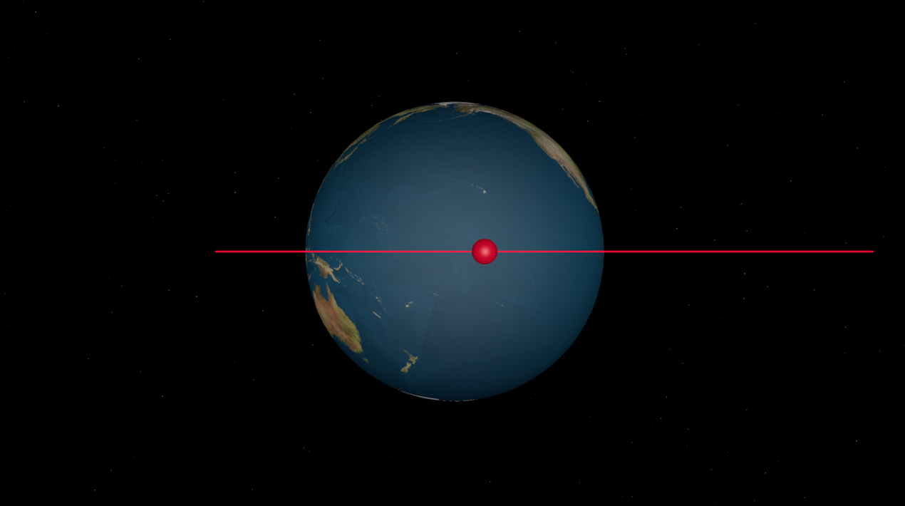
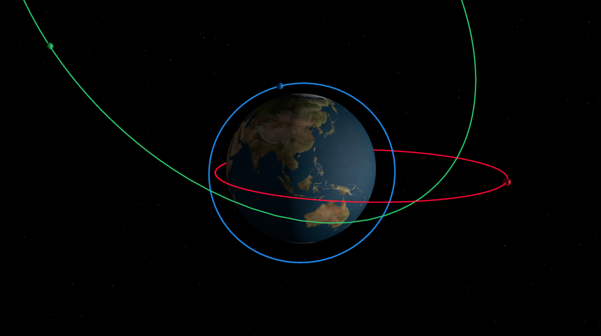
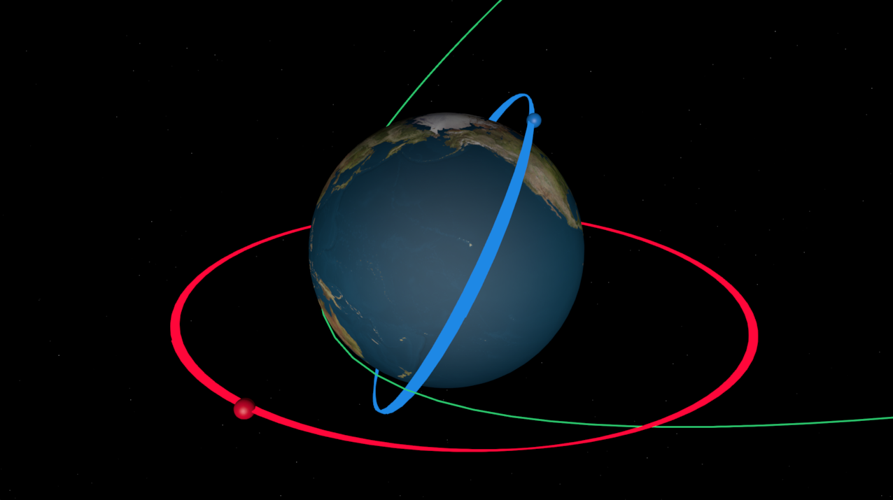

Quickstart Guide
================
This guide is intended to familiarize the user with the basics of orbit propagation and determination in HohmannPy as
well as how to display results.

Your First Simulation
^^^^^^^^^^^^^^^^^^^^^
The core of HohmannPy is the :class:`~hohmannpy.astro.Mission` class. Everything needed to simulate an orbit is
passed into this class during instantiation and then simulation and data generation is handled through methods of this
class. ``Mission`` takes a wide variety of parameters to allow for high levels of customization over a mission, but the
minimum required parameter set is actually fairly straight forward. The user simply needs to pass in information about
the spacecraft to simulate as well as the duration to simulate them for.

Spacecraft are created using the :class:`~hohmannpy.astro.Satellite` class. This holds all relevant information about a
satellite the ``Mission`` needs for propagation according its orbit at any point in time. Again, this class can be
instantiated with a slew of optional parameters but for a basic mission only three are needed: ``name``,
``starting_orbit``, and ``color``. The name and color are both ``str`` input by the user, with the latter being in
hexadecimal. ``starting_orbit`` must be a :class:`~hohmannpy.astro.Orbit` object. The simplest way to create an
``Orbit`` is using its base ``__init__()`` which takes in a position and velocity vector as well as the gravitational
parameter of the orbit's central body.

.. code-block:: python

    starting_orbit = hp.astro.Orbit(
        position=np.array([13047848.51, -4381785.841, 0]),
        velocity=np.array([3238.117862, 3770.591649, 0]),
        grav_param=3.986004418e14
    )

For all code in HohmannPy units should be SI (:math:`m`, :math:`kg`, :math:`s` etc;). Also, for Earth orbits the
``grav_param`` argument is technically optionally because the Earth's gravitational parameter is a default argument.
State-based orbit determination is simple but perhaps not very convenient, and as such HohmannPy contains a variety of
other orbit determination methods all contained as ``@classmethod`` methods of ``Orbit``. For this guide, we'll use
:meth:`~hohmannpy.astro.Orbit.from_classical()` to generate an orbit from the classical orbital elements.

.. code-block:: python

    starting_orbit = hp.astro.Orbit.from_classical_elements(
        sm_axis=12000e3,
        eccentricity=0.4,
        raan=np.deg2rad(115),
        argp=np.deg2rad(70),
        inclination=np.deg2rad(0),
        true_anomaly=np.deg2rad(132),
        grav_param=3.986004418e14
    ),

Internally, this method converts the classical elements to a position and velocity reading and then returns a call to
the base ``__init__()`` of ``Orbit``. This will generate an orbit identical to the one we previously used state-based
determination for. Note that because the orbit is equatorial the argument of periapsis is technically undefined, so any
arbitrary value will work. HohmannPy accounts for this (and other classical element singularities) and when we later
retrieve data on this orbit the argument of latitude will have been computed.

Now that we have an orbit, we can finally create our ``Satellite``.

.. code-block:: python

    starting_orbit = hp.astro.Orbit.from_classical_elements(
        sm_axis=12000e3,
        eccentricity=0.4,
        raan=np.deg2rad(115),
        argp=np.deg2rad(70),
        inclination=np.deg2rad(0),
        true_anomaly=np.deg2rad(132),
        grav_param=3.986004418e14
    )

    satellite = hp.astro.Satellite(
        name="Hohmann-1",
        starting_orbit=starting_orbit,
        color="#FF073A"
    )

All that remains before we instantiate the ``Mission`` is to determine the time of simulation. HohmannPy handles time
through a the :class:`~hohmannpy.astro.Time` class. This takes in the current Gregorian date and Universal Time 1 (UT1).
UT1 is based of the rotation rate of the Earth. It is similar to Universal Coordinated Time (UTC+0) but the latter
slowly diverges from the former over time. When this divergence grows to one second a leap second is added to (UTC+0) to
bring it back into alignment with UT1. For more info on UT1 and how to compute it see `Universal Time
<https://aa.usno.navy.mil/faq/UT>`_ by the *United States Navy's Astronomical Applications Department*. For most purposes
however, it is sufficient to approximate UT1 and UTC as being equivalent. ``Mission`` takes two time objects, one for
the start time and one for the end time which we create below.

.. code-block:: python

    initial_global_time = hp.astro.Time(
        date="03/01/2050",
        time="00:00:00"
    )
    final_global_time = hp.astro.Time(
        date="03/3/2050",
        time="00:00:00"
    )

The next thing to do is to choose a :class:`~hohmannpy.astro.Propagator`. This is the algorithm which is actually used
for orbit propagation. ``Mission`` defaults to :class:`~hohmannpy.astro.UniversalVariablePropagator` but for this
tutorial we'll change it to :class:`~hohmannpy.astro.KeplerPropagator` to show it off. This will use propagate the orbit
using Kepler's equation. The choice of propagator is complex and depends in part on whether or not external
perturbations are included (which is covered later in this guide). As a rule of thumb, ``UniversalVariablePropagator``
should be the go to if there are no external perturbations, otherwise use :class:`~hohmannpy.astro.CowellPropagator`.
Each ``Propagator`` has its own set of optional parameters which are algorithm-specific. For ``KeplerPropagator``, the
only thing we'll change is the ``step_size``. This defaults to 60 :math:`s` but this is a little overly cautious for our
simulation so we'll increase it to 180 :math:`s`.

.. code-block:: python

    propagator = hp.astro.KeplerPropagator(step_size=180)

The final thing we need to do is add :class:`~hohmannpy.astro.Logger` objects. These are used to record data over the
course of the mission. In the ``Mission``'s ``__init__()``, these ``Logger``s are deep copied onto each passed
``Satellite`` and then during simulation each ``Satellite`` logs its own data locally. Setting up a logger is trivial,
simply instantiate it without any arguments. For this tutorial we'll record the state (time, position, and velocity),
using :class:`~hohmannpy.astro.StateLogger`, and classical orbital elements, using
:class:`~hohmannpy.astro.ClassicalElementsLogger`.

.. code-block:: python

    logger1 = hp.astro.StateLogger()
    logger2 = hp.astro.ClassicalElementsLogger()

With all of that, we are good to create, run, and display our ``Mission``. After instantiation we call the method
:meth:`~hohmannpy.astro.Mission.simulate()` to perform propagation. We can then can call another method,
:meth:`~hohmannpy.astro.Mission.display()`, to launch a graphical application to display the orbit in real-time. If for
whatever reason a static rendering is preferred, simply pass ``display_flag="static"`` when calling ``display()``. The
full code is included below:

.. code-block:: python

    import hohmannpy as hp
    import numpy as np

    starting_orbit = hp.astro.Orbit.from_classical_elements(
        sm_axis=12000e3,
        eccentricity=0.4,
        raan=np.deg2rad(115),
        argp=np.deg2rad(70),
        inclination=np.deg2rad(0),
        true_anomaly=np.deg2rad(132),
        grav_param=3.986004418e14
    )

    satellite = hp.astro.Satellite(
        name="Hohmann-1",
        starting_orbit=starting_orbit,
        color="#FF073A"
    )

    initial_global_time = hp.astro.Time(
        date="03/01/2050",
        time="00:00:00"
    )
    final_global_time = hp.astro.Time(
        date="03/03/2050",
        time="00:00:00"
    )

    propagator = hp.astro.KeplerPropagator(step_size=180)

    logger1 = hp.astro.StateLogger()
    logger2 = hp.astro.ClassicalElementsLogger()

    mission = hp.astro.Mission(
        satellites=[satellite],
        initial_global_time=initial_global_time,
        final_global_time=final_global_time,
        propagator=propagator,
        loggers=[logger1, logger2],
    )
    mission.simulate()
    mission.display()

You should end up with a screen that looks like the following:

``display()`` is really launching an image of :class:`~hohmannpy.ui.DynamicRenderEngine` (or
:class:`~hohmannpy.ui.RenderEngine` if a static display is used). The camera orientation can be
controlled using the mouse, or alternatively using a keyboard:

    - **A:** rotate the clockwise
    - **D:** rotate counter-clockwise
    - **W:** rotate up
    - **S:** rotate down
    - **Q:** zoom out
    - **E:** zoom in

If a dynamic display is used, the following speed controls are also available:

    - **SPACE:** play/pause simulation
    - **1:** set speed to 1 sim second / 1 real second
    - **2:** set speed to 10 sim seconds / 1 real second
    - **3:** set speed to 100 sim seconds / 1 real second
    - **4:** set speed to 1000 sim seconds / 1 real second
    - **5:** set speed to 1000 0sim seconds / 1 real second

Finally, if we wanted to, we could log all data recorded by the loggers in a CSV file using the method
:meth:`~hohmannpy.astro.Mission.to_csv()`.

Increasing Simulation Complexity
^^^^^^^^^^^^^^^^^^^^^^^^^^^^^^^^
As previously mentioned, there are a variety of ways to increase the scope or accuracy of a ``Mission``. For the
remainder of this tutorial we'll focus on two simple ones: adding addition satellites, and adding in the influence of
the J2-effect (a perturbation due to the Earth's equatorial bulge). Our current satellite won't experience the full J2
effect because its in an equatorial orbit. To account for this, we'll add two additional satellites: one in an inclined
Earth orbit and the other in a parabolic escape orbit from the Earth. For the parabolic orbit, we can't use
``from_classical_elements()`` to instantiate it because that takes the semi-major axis which is infinite for parabolic
orbits. As such, we instead turn to :class:`~hohmannpy.astro.Orbit.from_classical_elements_p()` which uses the
semi-latus rectum instead and as such is still defined.

.. code-block:: python

    starting_orbit1 = hp.astro.Orbit.from_classical_elements(
        sm_axis=12000e3,
        eccentricity=0.4,
        raan=np.deg2rad(115),
        argp=np.deg2rad(70),
        inclination=np.deg2rad(0),
        true_anomaly=np.deg2rad(132),
        grav_param=3.986004418e14
    )
    starting_orbit2 = hp.astro.Orbit.from_classical_elements(
        sm_axis=8000e3,
        eccentricity=0,
        raan=np.deg2rad(5),
        argp=np.deg2rad(0),
        inclination=np.deg2rad(63.4),
        true_anomaly=0,
    )
    starting_orbit3 = hp.astro.Orbit.from_classical_elements_p(
        sl_rectum=13000e3,
        eccentricity=1,
        raan=np.deg2rad(40),
        argp=np.deg2rad(250),
        inclination=np.deg2rad(30),
        true_anomaly=np.deg2rad(330),
        grav_param=3.986004418e14
    )

As a consequence of adding a parabolic orbit, we also have to change the propagator to ``UniversalVariablePropagator``
because ``KeplerPropagator`` is can't handle parabolic orbits. With that, to include the additional satellites we simply
adjust our code as follows:

.. code-block:: python

    import hohmannpy as hp
    import numpy as np

    starting_orbit1 = hp.astro.Orbit.from_classical_elements(
        sm_axis=12000e3,
        eccentricity=0.4,
        raan=np.deg2rad(115),
        argp=np.deg2rad(70),
        inclination=np.deg2rad(0),
        true_anomaly=np.deg2rad(132),
        grav_param=3.986004418e14
    )
    starting_orbit2 = hp.astro.Orbit.from_classical_elements(
        sm_axis=8000e3,
        eccentricity=0,
        raan=np.deg2rad(5),
        argp=np.deg2rad(0),
        inclination=np.deg2rad(63.4),
        true_anomaly=0,
        grav_param=3.986004418e14
    )
    starting_orbit3 = hp.astro.Orbit.from_classical_elements_p(
        sl_rectum=13000e3,
        eccentricity=1,
        raan=np.deg2rad(40),
        argp=np.deg2rad(250),
        inclination=np.deg2rad(30),
        true_anomaly=np.deg2rad(230),
        grav_param=3.986004418e14
    )

    satellite1 = hp.astro.Satellite(
        name="Hohmann-1",
        starting_orbit=starting_orbit1,
        color="#FF073A"
    )
    satellite2 = hp.astro.Satellite(
        name="Hohmann-2",
        starting_orbit=starting_orbit2,
        color="#1E88E5"
    )
    satellite3 = hp.astro.Satellite(
        name="Hohmann-3",
        starting_orbit=starting_orbit3,
        color="#2ECC71"
    )

    initial_global_time = hp.astro.Time(
        date="03/01/2050",
        time="00:00:00"
    )
    final_global_time = hp.astro.Time(
        date="03/03/2050",
        time="00:00:00"
    )

    propagator = hp.astro.UniversalVariablePropagator(step_size=180)

    logger1 = hp.astro.StateLogger()
    logger2 = hp.astro.ClassicalElementsLogger()

    mission = hp.astro.Mission(
        satellites=[satellite1, satellite2, satellite3],
        initial_global_time=initial_global_time,
        final_global_time=final_global_time,
        propagator=propagator,
        loggers=[logger1, logger2],
    )
    mission.simulate()
    mission.display()

.. warning::

    Two satellites can not have the same ``name`` or propagation will fail because internally the ``Mission`` uses this
    to differentiate between different satellite trajectories.

Finally, we'll add the J2-effect using :class:`~hohmannpy.astro.J2`. HohmannPy includes a variety of different
perturbations including :class:~hohmannpy.astro.NonSphericalEarth` with is a generalization of ``J2`` to include other
non-spherical mass distributions besides the equatorial bulge. To add add ``J2``, we first instantiate it. Some
perturbations have very complex ``__init__()`` and even require passing additional parameters to every ``Satellite``
object, but ``J2`` only requires the initial Greenwich-mean sidereal time (GMST) at simulation start. This can be
accessed from any ``Time`` object via ``Time.gmst``.

.. code-block:: python

    j2 = hp.astro.J2(gmst=initial_global_time.gmst)

With that, we can now pass ``J2`` to ``Mission`` using the ``perturbing_forces`` parameter. Also, as previously
discussed neither ``KeplerPropagator`` or ``UniversalVariablePropagator`` allow perturbing forces so we switch to
propagation to using ``CowellPropagator``. At this point, we're ready to run the simulation, and the full code and
resulting rendering are included below.

.. code-block:: python

    import hohmannpy as hp
    import numpy as np

    starting_orbit1 = hp.astro.Orbit.from_classical_elements(
        sm_axis=12000e3,
        eccentricity=0.4,
        raan=np.deg2rad(115),
        argp=np.deg2rad(70),
        inclination=np.deg2rad(0),
        true_anomaly=np.deg2rad(132),
        grav_param=3.986004418e14
    )
    starting_orbit2 = hp.astro.Orbit.from_classical_elements(
        sm_axis=8000e3,
        eccentricity=0,
        raan=np.deg2rad(5),
        argp=np.deg2rad(0),
        inclination=np.deg2rad(63.4),
        true_anomaly=0,
        grav_param=3.986004418e14
    )
    starting_orbit3 = hp.astro.Orbit.from_classical_elements_p(
        sl_rectum=13000e3,
        eccentricity=1,
        raan=np.deg2rad(40),
        argp=np.deg2rad(250),
        inclination=np.deg2rad(30),
        true_anomaly=np.deg2rad(230),
        grav_param=3.986004418e14
    )

    satellite1 = hp.astro.Satellite(
        name="Hohmann-1",
        starting_orbit=starting_orbit1,
        color="#FF073A"
    )
    satellite2 = hp.astro.Satellite(
        name="Hohmann-2",
        starting_orbit=starting_orbit2,
        color="#1E88E5"
    )
    satellite3 = hp.astro.Satellite(
        name="Hohmann-3",
        starting_orbit=starting_orbit3,
        color="#2ECC71"
    )

    initial_global_time = hp.astro.Time(
        date="03/01/2050",
        time="00:00:00"
    )
    final_global_time = hp.astro.Time(
        date="03/03/2050",
        time="00:00:00"
    )

    propagator = hp.astro.CowellPropagator(step_size=180)

    logger1 = hp.astro.StateLogger()
    logger2 = hp.astro.ClassicalElementsLogger()

    j2 = hp.astro.J2(gmst=initial_global_time.gmst)

    mission = hp.astro.Mission(
        satellites=[satellite1, satellite2, satellite3],
        initial_global_time=initial_global_time,
        final_global_time=final_global_time,
        propagator=propagator,
        loggers=[logger1, logger2],
        perturbing_forces=[j2]
    )
    mission.simulate()
    mission.display()

Note the semi-major axis oscillation of the equatorial satellite's orbit and longitude of the right ascending node
precession of the inclined satellite, both hallmarks of the J2-effect.

That concludes this tutorial. Hopefully you found this helpful and best of luck with your future usage of HohmannPy. If
you have any questions feel free to open a discussion post on the `Github <https://github.com/hohmannpy/hohmannpy>`_.
